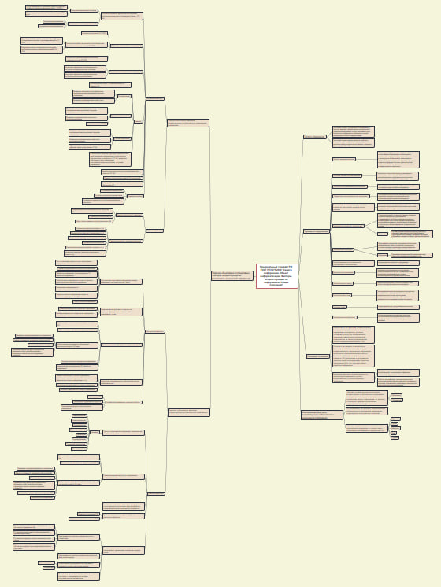

#Создание ментальной карты

## Цель работы

1. Изучение одного из российских стандартов из сферы информационной безопасности

2. Получить навыки систематизации информации с помощью ментальной карты и программного обеспечения FreePlane

## Ход выполнения практической работы

Был изучен национальный стандарт РФ ГОСТ Р 51275-2006 "Защита информации. Объект информатизации. Факторы, воздействующие на информацию. Общие положения".

С помощью программы FreePlane была создана ментальная карта.

## Оценка результата

В ходе выполнения практической работы была создана ментальная карта национального стандарта РФ ГОСТ Р 51275-2006 "Защита информации. Объект информатизации. Факторы, воздействующие на информацию. Общие положения".

## Выводы

Таким образом, с помощью интеллект карты удалось систематизировать информацию о стандарте в удобном для чтения виде.
